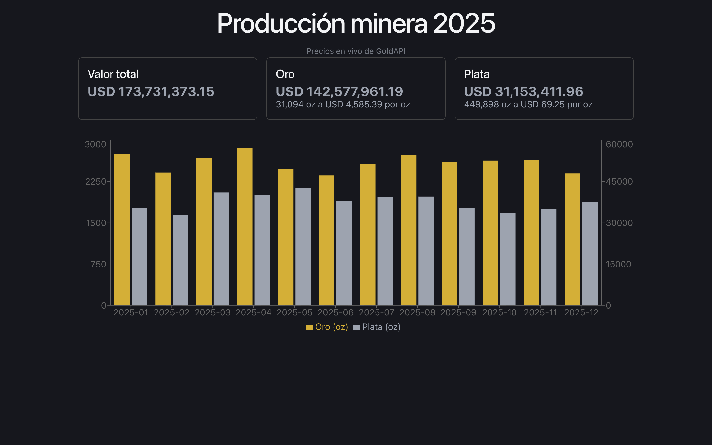

# Dashboard de Producción Minera



Dashboard para visualizar la producción mensual de oro y plata de tres unidades mineras y su valorización a precios de mercado.

## Stack

FastAPI + React (Vite) + Recharts

## Estructura del proyecto

```
backend/
├── app/
│   ├── main.py       # aplicación FastAPI y CORS
│   ├── config.py     # variables de entorno
│   ├── modelos.py    # modelos Pydantic
│   ├── datos.py      # carga y validación del JSON
│   ├── routers/      # endpoints
│   └── servicios/    # precios y cálculos
└── datos_produccion.json

frontend/
└── src/App.jsx
```

## Cómo levantarlo

### Backend

```bash
cd backend
python -m venv .venv
source .venv/bin/activate
pip install -r requirements.txt
cp .env.example .env   # añade tu token de GoldAPI (opcional)
uvicorn app.main:app --reload
```

> El token es opcional. Sin token, la app usa los precios de respaldo

### Frontend

```bash
cd frontend
npm install
npm run dev
```

## Endpoints

| Endpoint | Query params | Descripción |
|---|---|---|
| `GET /api/minas` | - | Lista de minas con su producción |
| `GET /api/produccion` | `mina_id`, `mes` | Registros planos, filtrables |
| `GET /api/resumen` | `mina_id` | Producción total por mes; alimenta el gráfico |
| `GET /api/valorizacion` | `mina_id` | Valor en USD, desglose por metal y origen del precio |

## Cómo probar el respaldo de precios

Quitar el token del .env y reiniciar. La interfaz muestra "Precios de respaldo" en lugar de "Precios de GoldAPI".

## Decisiones

1. Datos en memoria, no SQLite
2. Modelo Pydantic del documento JSON completo para validar al arrancar y fallar temprano
3. Los cuatro endpoints aceptan `mina_id`, para que el filtro afecte gráfico y tarjetas
4. `/api/produccion` devuelve registros planos, no minas anidadas
5. `404` para mina inexistente, y lista vacía para filtros sin resultados
6. El `404` lo lanza el servicio, que es lo pragmático en FastAPI. Lo purista sería que el servicio no conozca de HTTP.
7. Precios y cálculos separados. Cambian por razones distintas y el cálculo se prueba sin red
8. `float` con redondeo a 2 decimales, en producción se debería usar `Decimal` para mayor precisión
9. Código en español, siguiendo el vocabulario del contrato de la api de `datos_produccion.json`
10. Dos ejes Y en el gráfico, porque sino el oro (~2700 oz) no se apreciaría bien junto a la plata (~35000 oz)
11. Caché de precios en memoria por el límite de peticiones del plan gratuito

## Qué dejé fuera y qué mejoraría

Prioricé que el flujo completo funcione de punta a punta antes que las mejoras opcionales:

- **SQLite**: los datos son estáticos y caben en memoria sin problema.
- **Conversión a soles**.
- **Responsive completo**: las tarjetas se apilan por `flex-wrap`, pero no ajusté el gráfico.
- **Tests**.

Sí se implementó caché de precios, aunque no tiene un límite de expiración.

Lo que mejoraría sería empezar por los tests de `calcular_valorizacion`, ya que al no depender de la red ni de HTTP sería la función más facil de cubrir y la que concentra la logica de negocio.

Dejé fuera también una estructura o arquitectura más segmentada o separada en muchos archivos o clases, ya que al ser un proyecto pequeño no hacía falta, y sería mucha sobreingeniería innecesaria.
